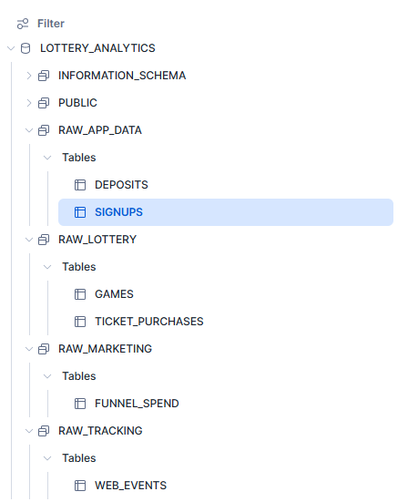
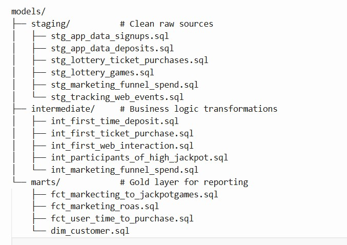
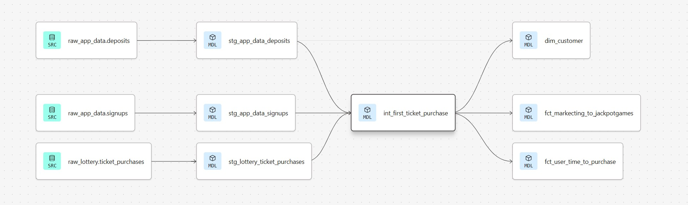
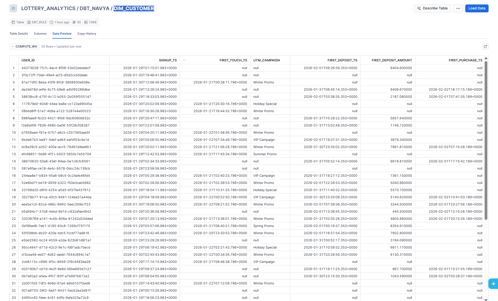

# Lottery Analytics snowflake-dbt Project

## Objective
This dbt project models marketing and player behavior for a lottery e-commerce company.  
It provides a trusted data model to measure:

1. Return on Ad Spend (ROAS) from first-time deposits.
2. Average time from first marketing interaction to first ticket purchase.
3. Marketing channel effectiveness for high-jackpot participants.

---
# **-------------TASK:1-----------------------**

##### Project Structure

RawData is stored in the snowflake under multiple schemas as follows 

###### **In SNOWFLAKE**

###### **In DBT**

## DAG / Model Dependencies

---
### Design Choices

- **Staging:** Cleans and standardizes raw sources with minimal transformation. Materialized as **views** to keep storage low and data fresh.  

- **Intermediate:** Calculates first-time events per user (first deposit, first purchase, first marketing interaction, high-jackpot flag). Materialized as **tables** for better performance and reuse in Gold models.  

- **Gold / Marts:** Produces final KPIs and `dim_customer` for reporting (ROAS, avg days to purchase, high-jackpot acquisition). Materialized as **tables** for fast, reliable queries.  

- **Time-Ordering:** All joins respect the sequence `signup_ts < first_marketing_interaction_ts < first_deposit_ts / first_purchase_ts` for accurate attribution.  

- **Identity Stitching:** `user_id` is primary key; fallback to `anonymous_user_id` for missing web events.  

- **Maintainability:** Intermediate tables prevent repeated heavy joins, Gold models remain readable, performant, and auditable.  

**Materialization Summary:** Views for freshness and low storage (staging), tables for performance and reuse (intermediate and Gold), balancing speed, cost, and reliability.

# **-------------TASK:2 : Transformation & Governance-------**
### Data Contract via YAML

The `schema.yml` files act as a **data contract** between the data team and consumers by:  

- **Defining columns and descriptions:** Consumers know exactly what each field represents.  
- **Enforcing business rules:** Tests like `not_null`, `unique`, and `first_purchase_ts >= signup_ts` ensure data quality.  
- **Providing consistency:** Changes to column names, types, or rules are version-controlled and communicated via YAML, so dashboards and downstream models can rely on the data.  

---

### Identity Stitching Approach

To unify users across sources:  

- **Primary key:** `user_id` is used across all datasets for joins.  
- **Fallback for anonymous events:** For web events with missing `user_id`, we use `anonymous_user_id`.  
- **Result:** Each user has a single, consistent identity across signups, deposits, ticket purchases, and web interactions.  
- **Benefit:** Enables accurate attribution, ROAS calculations, and reliable KPI reporting.

####### **SAMPLE OUTPUT**

